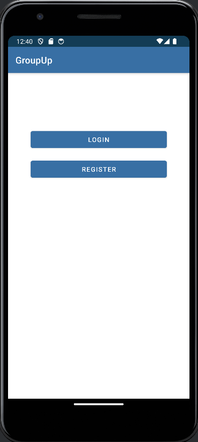
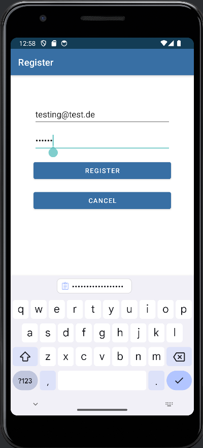
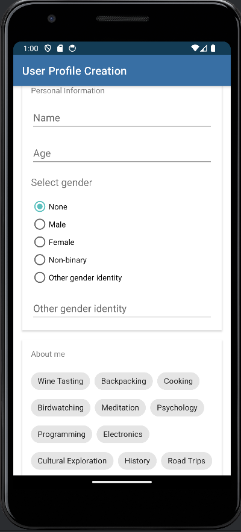
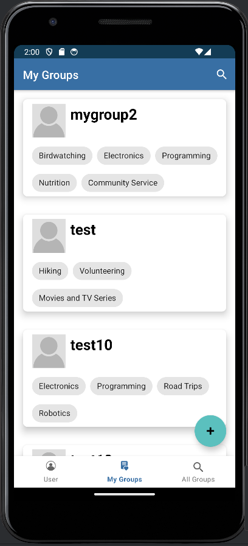
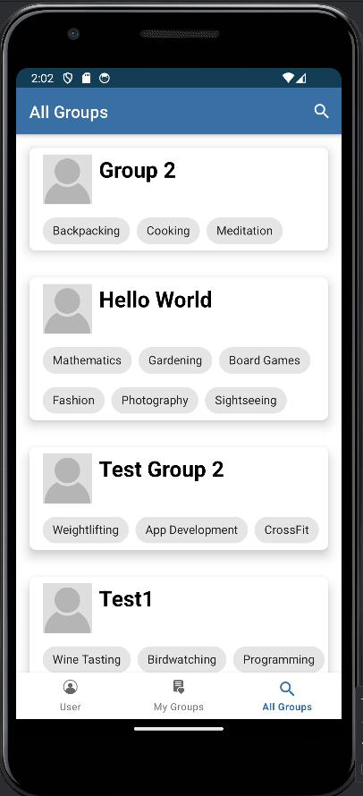
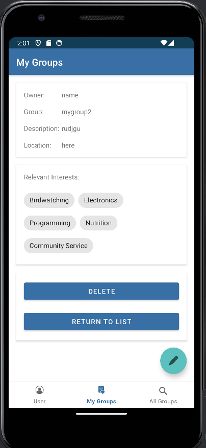

# GroupUp

# GroupUP Documentation

## Authors
- Elia Schmid (ID: 35823)
- Fabian Schotte (ID: 35604)

## Description
GroupUP is an app where users can find and join groups with similar or related interests. This makes it much easier to make new friends, especially when moving to a new city, for example.

## Target Audience
Our target audience primarily consists of students who often move to a distant city and initially know very few people. However, parents can also use GroupUP to find new hobbies for their children.

## Technical Features
A key technical feature of GroupUP is the Firestore database, which allows us to store, retrieve, edit, and delete groups and users.

## App Structure
The app has a simple structure. Upon launching the app, users are presented with the option to either log in with an existing account or create a new account (see Figure 1). During login, users enter their email address and password, after which they are directly taken to the app. During account creation, users provide a valid email address (not already in use) and a password. The email must be properly formatted, and the password must be at least 6 characters long; otherwise, no profile is created (see Figure 2). Upon meeting these criteria, users proceed to the next step. Here, users can provide their name, age, gender, and select from a limited list of interests. They can simply tap on interests that apply to them, which will then be added to their profile. After completing this step, users can optionally provide a description about themselves. Finally, they click on "Save", and the profile is added to the Firestore database (see Figure 3). Now, users are in the main area of the app. By clicking on the FAB button in the bottom right corner, users can return to the previously mentioned area. Navigation through the app is done by clicking on the navigation bar at the bottom of the screen. On the left is the user profile, in the middle is a list of groups the user has joined, and the option to create a group, while on the right is a list of all groups stored in the database (see Figures 4 and 5). Group creation is similar to profile creation. Users provide a name, location (currently entered manually), and select interests from the same list as in profile creation. The view displaying all groups is structured similarly to the view of joined groups. The only change in the interface is the absence of the FAB button, replaced by a search function at the top right of the screen, which is currently non-functional. Clicking on a group, whether in "My Groups" or "All Groups", displays the detailed view of the group. Here, users can see the group creator, name, description, location, and interests of the group. In this view, users can add or remove the group from their personal list (see Figure 6).

## Evaluation Criteria
Please pay particular attention to the calls to and from the Firestore database, as this was the most time-consuming aspect for us.

## Conclusion
Finally, here are a few screenshots from the app that may be helpful for understanding its structure:

- Figure 1: Start Screen
 
- Figure 2: Registration

- Figure 3: Profile Creation

- Figure 4: User's Groups

- Figure 5: All Groups

- Figure 6: Group Details